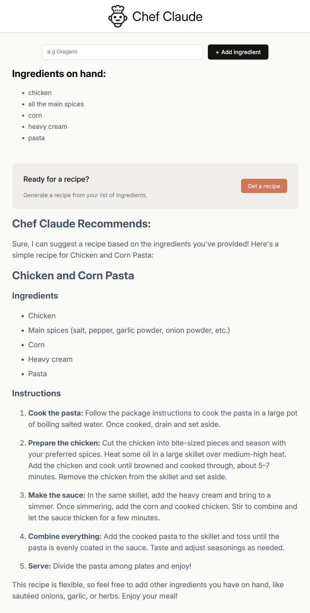

# Chef Claude 🧑‍🍳

A full-stack AI-powered recipe recommender built with React + Node.js + Hugging Face.



## Features

- 🔍 Enter ingredients you have at home
- 🧠 AI suggests a recipe using Hugging Face's Mixtral model
- 📄 Recipes formatted in Markdown
- 🔒 API key secured via Express backend
- 💡 Clean, responsive design

---

## 📦 Tech Stack

| Layer     | Tech                     |
|-----------|--------------------------|
| Frontend  | React + Vite             |
| Styling   | Custom CSS               |
| Backend   | Node.js + Express        |
| AI Model  | Hugging Face Inference API (`Mixtral-8x7B`) |
| Markdown  | react-markdown           |

---

## 🚀 Getting Started

### 🔧 Setup (Local Development)

#### 1. Clone the project

```bash
git clone https://github.com/yourusername/chef-claude.git
cd chef-claude
```

### 2. Set up the backend
```bash
cd backend
cp .env.example .env
# Add your Hugging Face token in .env
npm install
node index.js
```

### 3. Set up the frontend
```bash
cd ../frontend
npm install
npm run dev
```

Visit `http://localhost:5173/`

## License
`MIT`

## 🤝 Contributing
Feel free to fork, suggest improvements, or open PRs!
